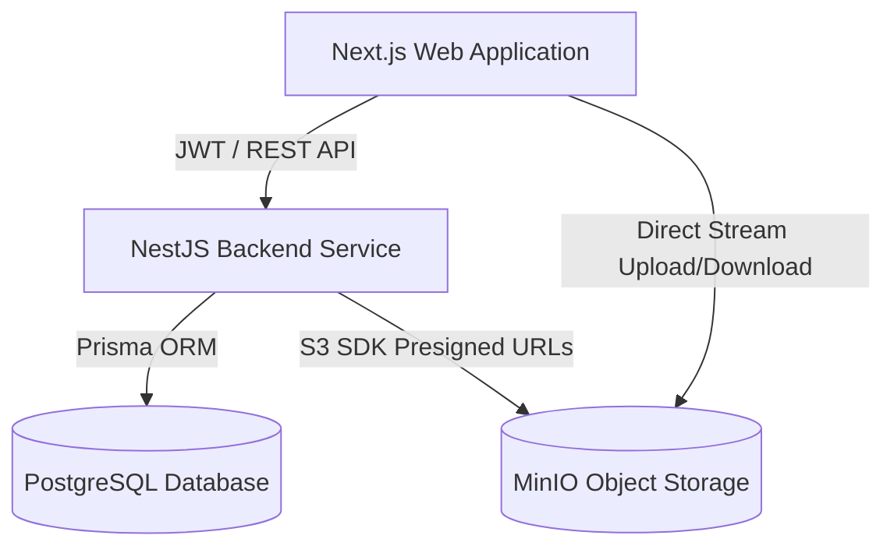

# ProofLedger – Secure Digital Evidence Management Platform


-black?style=for-the-badge&logo=nextdotjs)


**ProofLedger** is an enterprise-grade digital evidence management platform (DEMP) engineered for law enforcement agencies, digital forensics units, and legal audit teams. It guarantees **end-to-end chain-of-custody tracking**, **SHA-256 cryptographic evidence integrity verification**, **multi-tenant organization RBAC**, and **peer review workflows** with zero-trust security principles.

---

## 🌟 Key Features

### 1. 🛡️ Cryptographic Evidence Integrity & S3 Storage
* **SHA-256 Hash Verification**: Computes cryptographic checksums at ingestion. Supports instant real-time tamper-checking by comparing stored hashes against physical file contents.
* **Private MinIO / S3 Storage**: Evidence files are stored securely in isolated buckets. Direct client downloads and uploads are mediated via short-lived **Pre-signed URLs**.
* **File Versioning & Archival**: Supports immutable evidence status transitions (`COLLECTED` → `ANALYZING` → `IN_CUSTODY` → `SUBMITTED_TO_COURT` → `ARCHIVED`).

### 2. 🔐 Multi-Tenant Organization RBAC & Case Access Control
* **Organization Hierarchy**: Isolated tenant spaces (`Cyber Forensics Unit`, `Financial Crimes Division`).
* **Org-Level Roles**: `OWNER`, `ADMIN`, `MEMBER`, `GUEST` with strict permission guards.
* **Case Access Matrix**: Granular case-level member assignments (`LEAD_INVESTIGATOR`, `INVESTIGATOR`, `REVIEWER`, `VIEWER`).

### 3. 📜 Immutable Chain of Custody
* **Chronological Handling Logs**: Automatically captures evidence transfers, check-ins, check-outs, court presentations, and forensic analyses.
* **Actor Attribution**: Links every physical movement or digital access to verified user identities, timestamps, and locations.

### 4. ⚖️ Peer Review & Approval Workflow
* **Formal Review Pipeline**: Investigators can submit evidence for peer or supervisor review (`PENDING` → `IN_PROGRESS` → `APPROVED` / `REJECTED`).
* **Decision Tracking**: Captures reviewer feedback, official approval notes, and status transition timestamps.

### 5. 🔍 System-Wide Audit Logging
* **Tamper-Evident Logs**: Centralized compliance log recording system actions, resource mutations, user identities, client IP addresses, and user-agent metadata.
* **Interactive Filtering & JSON Inspector**: Frontend timeline interface with payload inspection for security audits.

---

## 🏗️ System Architecture



### Technology Stack
* **Frontend**: Next.js 14 (App Router), TypeScript, Tailwind CSS, Lucide Icons, Glassmorphic UI Design
* **Backend**: NestJS 10, TypeScript, Prisma ORM 5, Passport.js JWT Authentication, Swagger OpenAPI
* **Database**: PostgreSQL 16 (Relational Schema with Enums and Indexes)
* **Object Storage**: MinIO / AWS S3 Compatible Storage Service
* **Security**: Helmet, CORS policies, Rate Limiting, Bcrypt password hashing, Class Validator DTOs
* **DevOps**: Docker, Docker Compose, GitHub Actions CI/CD pipeline

---

## 🚀 Quickstart & Local Setup

### Prerequisites
* **Node.js**: `v20.x` or later
* **Docker & Docker Compose**: Installed and running

### 1. Clone & Install Dependencies
```bash
cd ~/Documents/ProofLedger
npm install
```

### 2. Start Infrastructure Services (Database & MinIO)
```bash
docker compose up -d
```
* **PostgreSQL**: `localhost:5433` (User: `proofledger`, DB: `proofledger_db`)
* **MinIO API**: `localhost:9090` (Access Key: `minioadmin`, Secret: `minioadmin`)
* **MinIO Console**: `http://localhost:9091`

### 3. Run Prisma Migrations & Seed Demo Data
```bash
cd apps/api
npx prisma migrate dev
npx prisma db seed
```

### 4. Start Development Servers
In separate terminal windows:
```bash
# Start NestJS API (Port 3000)
cd apps/api
npm run start:dev

# Start Next.js Web Frontend (Port 3001)
cd apps/web
npm run dev
```

---

## 🔑 Pre-seeded Demo Credentials

All demo accounts use the password: `Password123!`

| Role | Email | Organization | Case Access |
| :--- | :--- | :--- | :--- |
| **Super Admin** | `admin@proofledger.org` | Cyber Forensics Unit (Owner) | Lead Investigator (Financial Audit) |
| **Lead Investigator** | `investigator@proofledger.org` | Cyber Forensics Unit (Admin) | Lead Investigator (DarkNet Breach) |
| **Forensic Analyst** | `analyst@proofledger.org` | Cyber Forensics Unit (Member) | Investigator (DarkNet Breach) |
| **Auditor / Reviewer** | `auditor@proofledger.org` | Cyber Forensics Unit (Member) | Reviewer (DarkNet Breach) |

---

## 📚 Documentation & Guides

* 📖 [**Demo Guide (`DEMO_GUIDE.md`)**](file:///Users/Asmaa.Farhathm/Documents/ProofLedger/DEMO_GUIDE.md): 3-5 minute live demonstration walkthrough script & technical Q&A interview guide.
* 🚀 [**Deployment Checklist (`DEPLOYMENT_CHECKLIST.md`)**](file:///Users/Asmaa.Farhathm/Documents/ProofLedger/DEPLOYMENT_CHECKLIST.md): Production hardening, environment configuration, and SSL deployment guide.
* 🛡️ [**Security Policy (`SECURITY.md`)**](file:///Users/Asmaa.Farhathm/Documents/ProofLedger/SECURITY.md): Vulnerability reporting, cryptographic policies, and security architecture.
* 📸 [**Screenshots Guide (`SCREENSHOTS_GUIDE.md`)**](file:///Users/Asmaa.Farhathm/Documents/ProofLedger/SCREENSHOTS_GUIDE.md): Visual overview of key application flows.

---

## 📄 License
This project is licensed under the MIT License - see the `LICENSE` file for details.
